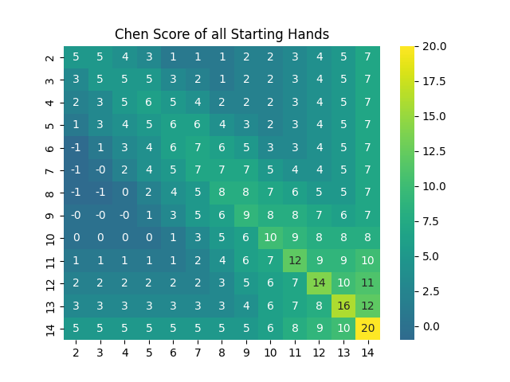

# Poker Bot
This bot serves to autonomously dictate the most effective course of action in a game of "Texas Hold 'em" poker.
## Setup
1. Clone Repo
2. Download and extract Eigen: https://eigen.tuxfamily.org
3. Add to local directory

## v1.0
The preliminary implementation of this bot utilizes the Chen Formula to dictate the strength of its hole cards preflop. This heuristic does not take into account the number of players, the computers position at the table, stack size, or various other factors. Changes including a more detailed algorithm will follow in future versions.

The .py script used to generate this heatmap, along with the .csv file of all of these values can be found in the aux_scripts subdirectory.